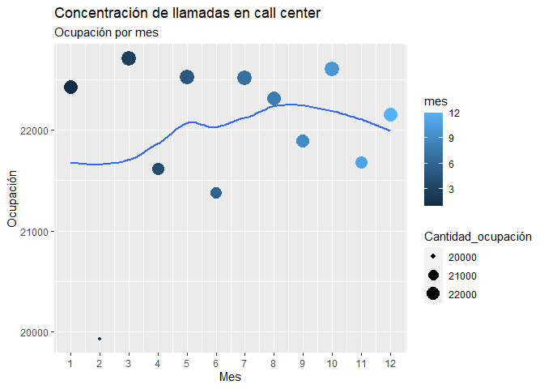

Laboratorio5_Javier_Mazariegos
================
Javier Alejandro Mazaiegos Godoy
2022-09-28

``` r
library(lubridate)
```

    ## 
    ## Attaching package: 'lubridate'

    ## The following objects are masked from 'package:base':
    ## 
    ##     date, intersect, setdiff, union

``` r
library(readxl)
library(dplyr)
```

    ## 
    ## Attaching package: 'dplyr'

    ## The following objects are masked from 'package:stats':
    ## 
    ##     filter, lag

    ## The following objects are masked from 'package:base':
    ## 
    ##     intersect, setdiff, setequal, union

``` r
library(stringr)
library(nycflights13)
library(tidyr)
library(ggplot2)
```

# Parte 1: Predecir un eclipse solar

``` r
eclipse_historico = ymd_hms("2017-08-21 18:26:42")
synodic_month = days(29) + hours(12) + minutes(44) + seconds(3)
saros = 223 * synodic_month
siguiente_eclipse = eclipse_historico + saros
```

``` r
siguiente_eclipse
```

    ## [1] "2035-09-02 02:09:51 UTC"

# Parte 2: Agrupaciones y operaciones con fechas

``` r
df <- readxl::read_excel('data.xlsx')
str(df)
```

    ## tibble [263,725 x 9] (S3: tbl_df/tbl/data.frame)
    ##  $ Fecha Creación: chr [1:263725] "43020" "19-03-17" "13-03-17" "14-04-17" ...
    ##  $ Hora Creación : POSIXct[1:263725], format: "1899-12-31 22:18:36" "1899-12-31 17:35:32" ...
    ##  $ Caller ID     : num [1:263725] 368224 368224 368224 368224 748633 ...
    ##  $ Cod           : chr [1:263725] "Cancelaciones" "Otros/Varios" "Consultas" "Consultas" ...
    ##  $ Email         : num [1:263725] 0 0 0 0 0 0 0 0 0 0 ...
    ##  $ SMS           : num [1:263725] 1 1 1 1 1 1 1 1 1 1 ...
    ##  $ Call          : num [1:263725] 0 0 0 0 0 0 0 0 0 0 ...
    ##  $ Fecha Final   : chr [1:263725] "43020" "19-03-17" "13-03-17" "14-04-17" ...
    ##  $ Hora Final    : POSIXct[1:263725], format: "1899-12-31 22:29:36" "1899-12-31 17:52:32" ...

``` r
#as.Date(43020, origin = "1899-12-30")
#as_date(strptime("19-03-17",format = "%d-%m-%y"))
formato_fecha = df %>% filter(str_detect(`Fecha Creación`,"-") == TRUE)
formato_fecha$`Fecha Creación` = as_date(strptime(formato_fecha$`Fecha Creación`,format = "%d-%m-%y"))
formato_fecha$`Fecha Final` = as_date(strptime(formato_fecha$`Fecha Final`,format = "%d-%m-%y"))

formato_numero = df %>% filter(str_detect(`Fecha Creación`,"-") == FALSE ) 
class(formato_numero$`Fecha Creación`) = "numeric"
class(formato_numero$`Fecha Final`) = "numeric"
formato_numero$`Fecha Creación`= as.Date(formato_numero$`Fecha Creación`,origin = "1899-12-30")
formato_numero$`Fecha Final`= as.Date(formato_numero$`Fecha Final`,origin = "1899-12-30")

unido = bind_rows(formato_numero,formato_fecha)
```

## 2.1 ¿En qué meses existe una mayor cantidad de llamadas por código?

``` r
#1. ¿En qué meses existe una mayor cantidad de llamadas por código?
unido = as.data.frame(unido)
meses_codigo = unido %>%
               filter(Call == 1) %>%
               select(Cod,`Fecha Creación`) %>%
               group_by(Cod,mes = lubridate::month(`Fecha Creación`)) %>%
               count(Cod,name = "No_llamadas") %>%
               group_by(Cod) %>%
               arrange(desc(No_llamadas))
```

``` r
meses_codigo
```

    ## # A tibble: 12 x 3
    ## # Groups:   Cod [1]
    ##    Cod                            mes No_llamadas
    ##    <chr>                        <dbl>       <int>
    ##  1 Actualización de Información     3         497
    ##  2 Actualización de Información     7         496
    ##  3 Actualización de Información     5         494
    ##  4 Actualización de Información    11         493
    ##  5 Actualización de Información    10         487
    ##  6 Actualización de Información    12         478
    ##  7 Actualización de Información     8         474
    ##  8 Actualización de Información     6         471
    ##  9 Actualización de Información     1         465
    ## 10 Actualización de Información     9         465
    ## 11 Actualización de Información     4         462
    ## 12 Actualización de Información     2         443

## 2.2 ¿Qué día de la semana es el más ocupado?

``` r
# 2.    ¿Qué día de la semana es el más ocupado?
actividad_por_semana = unido %>% 
                       group_by(dia = wday(`Fecha Creación`,label = TRUE, abbr = FALSE)) %>%
                       count(dia, name = "Cantidad_ocupación") %>%
                       arrange(desc(Cantidad_ocupación))
```

Se puede observar que el dia de la semana que más ocupado está el call
center es el domingo

``` r
actividad_por_semana
```

    ## # A tibble: 7 x 2
    ## # Groups:   dia [7]
    ##   dia       Cantidad_ocupación
    ##   <ord>                  <int>
    ## 1 domingo                38254
    ## 2 jueves                 37726
    ## 3 martes                 37710
    ## 4 sábado                 37614
    ## 5 miércoles              37511
    ## 6 lunes                  37501
    ## 7 viernes                37409

## 2.3 ¿Qué mes es el más ocupado?

``` r
# 3.    ¿Qué mes es el más ocupado?
actividad_por_mes = unido %>% 
                       group_by(mes = month(`Fecha Creación`,label = TRUE, abbr = FALSE)) %>%
                       count(mes, name = "Cantidad_ocupación") %>%
                       arrange(desc(Cantidad_ocupación))
```

Se puede observar que el mes que más ocupado está el call center es en
Marzo

``` r
actividad_por_mes
```

    ## # A tibble: 12 x 2
    ## # Groups:   mes [12]
    ##    mes        Cantidad_ocupación
    ##    <ord>                   <int>
    ##  1 marzo                   22708
    ##  2 octubre                 22601
    ##  3 mayo                    22525
    ##  4 julio                   22514
    ##  5 enero                   22425
    ##  6 agosto                  22316
    ##  7 diciembre               22151
    ##  8 septiembre              21891
    ##  9 noviembre               21681
    ## 10 abril                   21611
    ## 11 junio                   21370
    ## 12 febrero                 19932

## 2.4 ¿Existe una concentración o estacionalidad en la cantidad de llamadas?

Se puede ver una mayor concentración de llamadas en el mes de Marzo y en
el mes de Octubre, además, llama la atención la poca concentración de
llamadas que hay en febrero.

``` r
# 4.    ¿Existe una concentración o estacionalidad en la cantidad de llamadas?
actividad_por_mes = unido %>% 
                       group_by(mes = month(`Fecha Creación`)) %>%
                       count(mes, name = "Cantidad_ocupación")

gg <- ggplot(actividad_por_mes, aes(x=mes, y=Cantidad_ocupación)) + 
  geom_point(aes(col=mes, size=Cantidad_ocupación)) + 
  geom_smooth(method="loess", se=F) + 
  labs(subtitle="Ocupación por mes", 
       y="Ocupación", 
       x="Mes", 
       title="Concentración de llamadas en call center") +
  scale_x_continuous(breaks = c(1:12))

plot(gg)
```

    ## `geom_smooth()` using formula 'y ~ x'

<!-- -->

## 2.5 ¿Cuántos minutos dura la llamada promedio?

``` r
#5. ¿Cuántos minutos dura la llamada promedio?
unido$`Hora Creación`<- hms(format(unido$`Hora Creación`, format="%H:%M:%S"))
unido$`Hora Final`<- hms(format(unido$`Hora Final`, format="%H:%M:%S"))
unido <- na.omit(unido)
unido$duracion <- as.double(unido$`Hora Final` - unido$`Hora Creación`, units="minutes")
llamadas <- unido %>% filter(Call == 1)
llamada_promedio = mean(llamadas$duracion)
```

``` r
llamada_promedio
```

    ## [1] 7.766638

## 2.6 Realice una tabla de frecuencias con el tiempo de llamada.

``` r
frecuencias <- unido %>%
               filter(Call == 1) %>%
               group_by(duracion) %>%
               count(duracion,name = "Cantidad de llamadas")
```

``` r
frecuencias
```

    ## # A tibble: 48 x 2
    ## # Groups:   duracion [48]
    ##    duracion `Cantidad de llamadas`
    ##       <dbl>                  <int>
    ##  1    -1434                      1
    ##  2    -1433                      1
    ##  3    -1432                      3
    ##  4    -1431                      1
    ##  5    -1430                      1
    ##  6    -1429                      1
    ##  7    -1428                      1
    ##  8    -1425                      1
    ##  9    -1424                      1
    ## 10    -1423                      2
    ## # ... with 38 more rows

# Parte 3: Signo Zodiacal

``` r
fun <- function(fecha_n){
  
  fecha_n = make_date(year = 2022, month = month(fecha_n), day = day(fecha_n))
  
  if(fecha_n %within% interval(as_date("01-01-2022",format='%d-%m-%Y'),as_date("20-01-2022",format='%d-%m-%Y'))){
    return("Capricornio")
  }
  else if(fecha_n %within% interval(as_date("21-01-2022",format='%d-%m-%Y'),as_date("19-02-2022",format='%d-%m-%Y'))){
    return("Acuario")
  }
  else if(fecha_n %within% interval(as_date("20-02-2022",format='%d-%m-%Y'),as_date("20-03-2022",format='%d-%m-%Y'))){
    return("Piscis")
  }
  else if(fecha_n %within% interval(as_date("21-03-2022",format='%d-%m-%Y'),as_date("20-04-2022",format='%d-%m-%Y'))){
    return("Aries")
  }
  else if(fecha_n %within% interval(as_date("21-04-2022",format='%d-%m-%Y'),as_date("21-05-2022",format='%d-%m-%Y'))){
    return("Tauro")
  }
  else if(fecha_n %within% interval(as_date("22-05-2022",format='%d-%m-%Y'),as_date("21-06-2022",format='%d-%m-%Y'))){
    return("Géminis")
  }
  else if(fecha_n %within% interval(as_date("22-06-2022",format='%d-%m-%Y'),as_date("22-07-2022",format='%d-%m-%Y'))){
    return("Cáncer")
  }
  else if(fecha_n %within% interval(as_date("23-07-2022",format='%d-%m-%Y'),as_date("22-08-2022",format='%d-%m-%Y'))){
    return("Leo")
  }
  else if(fecha_n %within% interval(as_date("23-08-2022",format='%d-%m-%Y'),as_date("22-09-2022",format='%d-%m-%Y'))){
    return("Virgo")
  }
  else if(fecha_n %within% interval(as_date("23-09-2022",format='%d-%m-%Y'),as_date("22-10-2022",format='%d-%m-%Y'))){
    return("Libra")
  }
  else if(fecha_n %within% interval(as_date("23-10-2022",format='%d-%m-%Y'),as_date("22-11-2022",format='%d-%m-%Y'))){
    return("Escorpio")
  }
  else if(fecha_n %within% interval(as_date("23-11-2022",format='%d-%m-%Y'),as_date("21-12-2022",format='%d-%m-%Y'))){
    return("Sagitario")
  }
  else if(fecha_n %within% interval(as_date("22-12-2022",format='%d-%m-%Y'),as_date("31-12-2022",format='%d-%m-%Y'))){
    return("Capricornio")
  }
  else{
    return("Error")
  }
  
  
  
}
```

``` r
#Realice una función que reciba como input su fecha de nacimiento y devuelva como output su signo zodiacal.

#fecha_nacimiento = readline(prompt = "Ingrese su edad en el siguiente fromato (dia-mes-año) : ");
fecha_nacimiento = "05-04-2202"
fecha_nacimiento = dmy(fecha_nacimiento,format = "%d-%m-%y")
```

    ## Warning: 1 failed to parse.

``` r
fun(as.Date(fecha_nacimiento[1]))
```

    ## [1] "Aries"

# Parte 4: Flights

## 1. Genere 4 nuevas columnas para cada variable con formato fecha y hora.

``` r
tabla = flights
# 1.    Genere 4 nuevas columnas para cada variable con formato fecha y hora.

#dep_time
tiempo_uno = tabla %>% filter(dep_time < 1000)
tiempo_dos = tabla %>% filter(dep_time >=1000)

tiempo_uno$hora <- substr(tiempo_uno$dep_time,1,1)
tiempo_uno$minuto <- substr(tiempo_uno$dep_time,2,3)

tiempo_dos$hora <- substr(tiempo_dos$dep_time,1,2)
tiempo_dos$minuto <- substr(tiempo_dos$dep_time,3,4)

tiempo_total = bind_rows(tiempo_uno,tiempo_dos)
class(tiempo_total$hora) = "integer"

tiempo_total$dep_time_hora = make_datetime(year = tiempo_total$year, month = tiempo_total$month, day = tiempo_total$day, hour = tiempo_total$hora, min = tiempo_total$minuto)

tiempo_total
```

    ## # A tibble: 328,521 x 22
    ##     year month   day dep_time sched_dep_time dep_delay arr_time sched_arr_time
    ##    <int> <int> <int>    <int>          <int>     <dbl>    <int>          <int>
    ##  1  2013     1     1      517            515         2      830            819
    ##  2  2013     1     1      533            529         4      850            830
    ##  3  2013     1     1      542            540         2      923            850
    ##  4  2013     1     1      544            545        -1     1004           1022
    ##  5  2013     1     1      554            600        -6      812            837
    ##  6  2013     1     1      554            558        -4      740            728
    ##  7  2013     1     1      555            600        -5      913            854
    ##  8  2013     1     1      557            600        -3      709            723
    ##  9  2013     1     1      557            600        -3      838            846
    ## 10  2013     1     1      558            600        -2      753            745
    ## # ... with 328,511 more rows, and 14 more variables: arr_delay <dbl>,
    ## #   carrier <chr>, flight <int>, tailnum <chr>, origin <chr>, dest <chr>,
    ## #   air_time <dbl>, distance <dbl>, hour <dbl>, minute <dbl>, time_hour <dttm>,
    ## #   hora <int>, minuto <chr>, dep_time_hora <dttm>

``` r
tiempo_uno = tiempo_total %>% filter(arr_time < 1000)
tiempo_dos = tiempo_total %>% filter(arr_time >=1000)

tiempo_uno$hora <- substr(tiempo_uno$arr_time,1,1)
tiempo_uno$minuto <- substr(tiempo_uno$arr_time,2,3)

tiempo_dos$hora <- substr(tiempo_dos$arr_time,1,2)
tiempo_dos$minuto <- substr(tiempo_dos$arr_time,3,4)

tiempo_total = bind_rows(tiempo_uno,tiempo_dos)
class(tiempo_total$hora) = "integer"

tiempo_total$arr_time_hora = make_datetime(year = tiempo_total$year, month = tiempo_total$month, day = tiempo_total$day, hour = tiempo_total$hora, min = tiempo_total$minuto)

tiempo_total
```

    ## # A tibble: 328,063 x 23
    ##     year month   day dep_time sched_dep_time dep_delay arr_time sched_arr_time
    ##    <int> <int> <int>    <int>          <int>     <dbl>    <int>          <int>
    ##  1  2013     1     1      517            515         2      830            819
    ##  2  2013     1     1      533            529         4      850            830
    ##  3  2013     1     1      542            540         2      923            850
    ##  4  2013     1     1      554            600        -6      812            837
    ##  5  2013     1     1      554            558        -4      740            728
    ##  6  2013     1     1      555            600        -5      913            854
    ##  7  2013     1     1      557            600        -3      709            723
    ##  8  2013     1     1      557            600        -3      838            846
    ##  9  2013     1     1      558            600        -2      753            745
    ## 10  2013     1     1      558            600        -2      849            851
    ## # ... with 328,053 more rows, and 15 more variables: arr_delay <dbl>,
    ## #   carrier <chr>, flight <int>, tailnum <chr>, origin <chr>, dest <chr>,
    ## #   air_time <dbl>, distance <dbl>, hour <dbl>, minute <dbl>, time_hour <dttm>,
    ## #   hora <int>, minuto <chr>, dep_time_hora <dttm>, arr_time_hora <dttm>

``` r
tiempo_uno = tiempo_total %>% filter(sched_dep_time < 1000)
tiempo_dos = tiempo_total %>% filter(sched_dep_time >=1000)

tiempo_uno$hora <- substr(tiempo_uno$sched_dep_time,1,1)
tiempo_uno$minuto <- substr(tiempo_uno$sched_dep_time,2,3)

tiempo_dos$hora <- substr(tiempo_dos$sched_dep_time,1,2)
tiempo_dos$minuto <- substr(tiempo_dos$sched_dep_time,3,4)

tiempo_total = bind_rows(tiempo_uno,tiempo_dos)
class(tiempo_total$hora) = "integer"

tiempo_total$sched_dep_time_hora = make_datetime(year = tiempo_total$year, month = tiempo_total$month, day = tiempo_total$day, hour = tiempo_total$hora, min = tiempo_total$minuto)

tiempo_total
```

    ## # A tibble: 328,063 x 24
    ##     year month   day dep_time sched_dep_time dep_delay arr_time sched_arr_time
    ##    <int> <int> <int>    <int>          <int>     <dbl>    <int>          <int>
    ##  1  2013     1     1      517            515         2      830            819
    ##  2  2013     1     1      533            529         4      850            830
    ##  3  2013     1     1      542            540         2      923            850
    ##  4  2013     1     1      554            600        -6      812            837
    ##  5  2013     1     1      554            558        -4      740            728
    ##  6  2013     1     1      555            600        -5      913            854
    ##  7  2013     1     1      557            600        -3      709            723
    ##  8  2013     1     1      557            600        -3      838            846
    ##  9  2013     1     1      558            600        -2      753            745
    ## 10  2013     1     1      558            600        -2      849            851
    ## # ... with 328,053 more rows, and 16 more variables: arr_delay <dbl>,
    ## #   carrier <chr>, flight <int>, tailnum <chr>, origin <chr>, dest <chr>,
    ## #   air_time <dbl>, distance <dbl>, hour <dbl>, minute <dbl>, time_hour <dttm>,
    ## #   hora <int>, minuto <chr>, dep_time_hora <dttm>, arr_time_hora <dttm>,
    ## #   sched_dep_time_hora <dttm>

``` r
tiempo_uno = tiempo_total %>% filter(sched_arr_time  < 1000)
tiempo_dos = tiempo_total %>% filter(sched_arr_time  >=1000)

tiempo_uno$hora <- substr(tiempo_uno$sched_arr_time ,1,1)
tiempo_uno$minuto <- substr(tiempo_uno$sched_arr_time ,2,3)

tiempo_dos$hora <- substr(tiempo_dos$sched_arr_time ,1,2)
tiempo_dos$minuto <- substr(tiempo_dos$sched_arr_time ,3,4)

tiempo_total = bind_rows(tiempo_uno,tiempo_dos)
class(tiempo_total$hora) = "integer"

tiempo_total$sched_arr_time_hora = make_datetime(year = tiempo_total$year, month = tiempo_total$month, day = tiempo_total$day, hour = tiempo_total$hora, min = tiempo_total$minuto)

tiempo_total
```

    ## # A tibble: 328,063 x 25
    ##     year month   day dep_time sched_dep_time dep_delay arr_time sched_arr_time
    ##    <int> <int> <int>    <int>          <int>     <dbl>    <int>          <int>
    ##  1  2013     1     1      517            515         2      830            819
    ##  2  2013     1     1      533            529         4      850            830
    ##  3  2013     1     1      542            540         2      923            850
    ##  4  2013     1     1      554            600        -6      812            837
    ##  5  2013     1     1      554            558        -4      740            728
    ##  6  2013     1     1      555            600        -5      913            854
    ##  7  2013     1     1      557            600        -3      709            723
    ##  8  2013     1     1      557            600        -3      838            846
    ##  9  2013     1     1      558            600        -2      753            745
    ## 10  2013     1     1      558            600        -2      849            851
    ## # ... with 328,053 more rows, and 17 more variables: arr_delay <dbl>,
    ## #   carrier <chr>, flight <int>, tailnum <chr>, origin <chr>, dest <chr>,
    ## #   air_time <dbl>, distance <dbl>, hour <dbl>, minute <dbl>, time_hour <dttm>,
    ## #   hora <int>, minuto <chr>, dep_time_hora <dttm>, arr_time_hora <dttm>,
    ## #   sched_dep_time_hora <dttm>, sched_arr_time_hora <dttm>

## 4.2 Encuentre el delay total que existe en cada vuelo. El delay total se puede encontrar sumando el delay de la salida y el delay de la entrada.

``` r
tiempo_total$delay_total = difftime(tiempo_total$dep_time_hora,tiempo_total$sched_dep_time_hora) + difftime(tiempo_total$arr_time_hora, tiempo_total$sched_arr_time_hora)
```

``` r
tiempo_total %>% select(delay_total)
```

    ## # A tibble: 328,063 x 1
    ##    delay_total
    ##    <drtn>     
    ##  1   780 secs 
    ##  2  1440 secs 
    ##  3  2100 secs 
    ##  4 -1860 secs 
    ##  5   480 secs 
    ##  6   840 secs 
    ##  7 -1020 secs 
    ##  8  -660 secs 
    ##  9   360 secs 
    ## 10  -240 secs 
    ## # ... with 328,053 more rows
