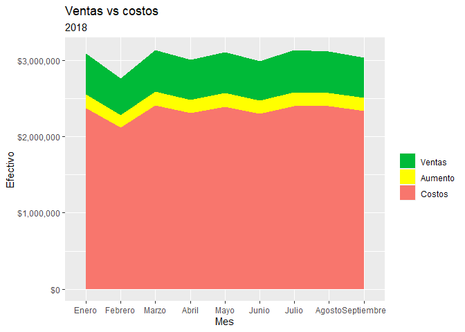

Laboratorio7
================
Javier Alejandro Mazaiegos Godoy
2022-10-12

\#`{r setup, include=FALSE} #knitr::opts_chunk$set(echo = TRUE) #`

``` r
library(readr)
library(lubridate)
```

    ## 
    ## Attaching package: 'lubridate'

    ## The following objects are masked from 'package:base':
    ## 
    ##     date, intersect, setdiff, union

``` r
library(dplyr)
```

    ## 
    ## Attaching package: 'dplyr'

    ## The following objects are masked from 'package:stats':
    ## 
    ##     filter, lag

    ## The following objects are masked from 'package:base':
    ## 
    ##     intersect, setdiff, setequal, union

``` r
library(stringr)
library(ggplot2)
library(tidyr)
library(qcc)
```

    ## Package 'qcc' version 2.7

    ## Type 'citation("qcc")' for citing this R package in publications.

``` r
library(data.table)
```

    ## 
    ## Attaching package: 'data.table'

    ## The following objects are masked from 'package:dplyr':
    ## 
    ##     between, first, last

    ## The following objects are masked from 'package:lubridate':
    ## 
    ##     hour, isoweek, mday, minute, month, quarter, second, wday, week,
    ##     yday, year

``` r
library(scales)
```

    ## 
    ## Attaching package: 'scales'

    ## The following object is masked from 'package:readr':
    ## 
    ##     col_factor

``` r
df <- read_delim("c1.csv", ",", escape_double = FALSE, trim_ws = TRUE)
```

    ## New names:
    ## Rows: 263725 Columns: 28
    ## -- Column specification
    ## -------------------------------------------------------- Delimiter: "," chr
    ## (17): Fecha, Camion_5, Pickup, Moto, Cod, factura, directoCamion_5, dire... dbl
    ## (5): ID, origen, Lat, Long, height lgl (6): ...23, ...24, ...25, ...26, ...27,
    ## ...28
    ## i Use `spec()` to retrieve the full column specification for this data. i
    ## Specify the column types or set `show_col_types = FALSE` to quiet this message.
    ## * `` -> `...23`
    ## * `` -> `...24`
    ## * `` -> `...25`
    ## * `` -> `...26`
    ## * `` -> `...27`
    ## * `` -> `...28`

``` r
df <- df[1:22]
df$Fecha <- dmy(df$Fecha)
df$factura <- as.double(substr(df$factura,2,nchar(df$factura)))
df$Camion_5 <- as.double(substr(df$Camion_5,2,nchar(df$Camion_5)))
```

    ## Warning: NAs introducidos por coerción

``` r
df$Pickup <- as.double(substr(df$Pickup,2,nchar(df$Pickup)))
```

    ## Warning: NAs introducidos por coerción

``` r
df$Moto <- as.double(substr(df$Moto,2,nchar(df$Moto)))
```

    ## Warning: NAs introducidos por coerción

``` r
df$directoCamion_5 <- as.double(substr(df$directoCamion_5,2,nchar(df$directoCamion_5)))
```

    ## Warning: NAs introducidos por coerción

``` r
df$directoPickup <- as.double(substr(df$directoPickup,2,nchar(df$directoPickup)))
```

    ## Warning: NAs introducidos por coerción

``` r
df$directoMoto <- as.double(substr(df$directoMoto,2,nchar(df$directoMoto)))
```

    ## Warning: NAs introducidos por coerción

``` r
df$fijoCamion_5 <- as.double(substr(df$fijoCamion_5,2,nchar(df$fijoCamion_5)))
```

    ## Warning: NAs introducidos por coerción

``` r
df$fijoPickup <- as.double(substr(df$fijoPickup,2,nchar(df$fijoPickup)))
```

    ## Warning: NAs introducidos por coerción

``` r
df$fijoMoto <- as.double(substr(df$fijoMoto,2,nchar(df$fijoMoto)))
```

    ## Warning: NAs introducidos por coerción

``` r
df$`5-30` <- as.numeric(gsub('x','1',df$`5-30`))
df$`30-45` <- as.numeric(gsub('x','1',df$`30-45`))
df$`45-75` <- as.numeric(gsub('x','1',df$`45-75`))
df$`75-120` <- as.numeric(gsub('x','1',df$`75-120`))
df$`120+` <- as.numeric(gsub('x','1',df$`120+`))
df[is.na(df)] <- 0
df <- df %>% mutate(Vehiculo = case_when(Camion_5 != 0 ~ "Camion", 
                              Pickup != 0~ "Pickup", 
                              Moto != 0 ~ "Moto"))
df <- df %>% mutate(Tiempo = case_when(`5-30` != 0 ~ "5-30", 
                              `30-45` != 0~ "30-45", 
                              `45-75` != 0 ~ "45-75",
                              `75-120` != 0 ~ "75-120",
                              `120+` != 0 ~ "120+"))
```

``` r
#¿Cuánto debemos crecer para poder llegar a los niveles del 2017?
df2017 <- df %>% filter(Fecha < "2017-10-01")

#¿Cuál fue la utilidad 2017?
Utilidad_2017 = df2017 %>% summarise("Utilidad" = sum(factura-(Camion_5 + Pickup + Moto)))
Utilidad_2017
```

    ## # A tibble: 1 x 1
    ##   Utilidad
    ##      <dbl>
    ## 1  6360360

``` r
#¿Cuál fue la utilidad 2018?
Utilidad_2018 = Utilidad_2017 *0.75
Utilidad_2018
```

    ##   Utilidad
    ## 1  4770270

``` r
Baja <- Utilidad_2017 *0.25
Baja
```

    ##   Utilidad
    ## 1  1590090

``` r
#¿Cuáles fueron las ventas 2017?
Ventas_2017 <- df2017 %>% summarise("ventas 2017" = sum(factura))
#¿Cuáles fueron los costos directos 2017?
Costos_directos_2017 <- df2017 %>% summarise("costos directos 2017" = sum(directoCamion_5 +directoPickup +directoMoto))
#¿Cuáles fueron los costos fijos 2017?
Costos_fijos_2017 <-  df2017 %>% summarise("costos fijos 2017" = sum(fijoCamion_5 + fijoPickup + fijoMoto))
#¿Cuáles son los costos totales 2017?
Costos_totales_2017 <- Costos_directos_2017 + Costos_fijos_2017
```

``` r
#Cantidad de ventas que ha tenido cada servicio
Ventas_servicio <- df2017 %>% group_by(Cod) %>% count(name="Ventas")

ggplot(data=Ventas_servicio, aes(x=Cod, y=Ventas)) +
  geom_bar(stat="identity",width = 0.8)+
  theme_minimal()+ theme(axis.text.x = element_text(angle = 45, hjust=0.9))+
  geom_label(aes(label=Ventas),na.rm=T,label.size=1.2,show.legend=F)
```

<!-- -->

``` r
#Precio de cada servicio
Precio_servicio <- df2017 %>% group_by(Cod) %>% summarise(Precio_unitario = round(sum(factura)/n(),2))
names(Precio_servicio) <- c("Servicio","Precio")

ggplot(data=Precio_servicio, aes(x=Servicio, y=Precio)) +
  geom_bar(stat="identity",width = 0.8)+
  theme_minimal()+ theme(axis.text.x = element_text(angle = 45, hjust=0.9))+
  geom_label(aes(label=Precio),na.rm=T,label.size=1.2,show.legend=F)
```

<!-- -->

``` r
#Costo unitario
Costo_servicio <- df2017 %>% group_by(Cod) %>% summarise(Costo_unitario = round(sum(Camion_5+Pickup+Moto)/n(),2))
names(Costo_servicio) <- c("Servicio","Costo")

ggplot(data=Costo_servicio, aes(x=Servicio, y=Costo)) +
  geom_bar(stat="identity",width = 0.8)+
  theme_minimal()+ theme(axis.text.x = element_text(angle = 45, hjust=0.9))+
  geom_label(aes(label=Costo),na.rm=T,label.size=1.2,show.legend=F)
```

<!-- -->

``` r
#Utilidad por producto
Ganancia_servicio <- df2017 %>% group_by(Cod) %>% summarise(Ganancia_unitario = round(sum(factura-Camion_5-Pickup-Moto)/n(),2))
names(Ganancia_servicio) <- c("Servicio","Utilidad")

ggplot(data=Ganancia_servicio, aes(x=Servicio, y=Utilidad)) +
  geom_bar(stat="identity",width = 0.8)+
  theme_minimal()+ theme(axis.text.x = element_text(angle = 45, hjust=0.9))+
  geom_label(aes(label=Utilidad),na.rm=T,label.size=1.2,show.legend=F)
```

<!-- -->

``` r
#Transporte

#Costos por transporte
Costos_transporte <- df2017 %>% summarise("Camion" = sum(Camion_5), "Pickup" = sum(Pickup), "Moto" = sum(Moto)) %>% pivot_longer(c("Camion","Pickup","Moto"),, names_to = "Tipo", values_to = "Gastos")


ggplot(data=Costos_transporte, aes(x=Tipo, y=Gastos)) +
  geom_bar(stat="identity",width = 0.8)+
  theme_minimal()+ theme(axis.text.x = element_text(angle = 45, hjust=0.9))+
  geom_label(aes(label=Gastos),na.rm=T,label.size=1.2,show.legend=F)
```

<!-- -->

``` r
#Cantidad de ventas por tipo de vehiculo
Ventas_transporte <- df2017 %>% group_by(Vehiculo) %>% count(name="Cantidad_ventas")

ggplot(data=Ventas_transporte, aes(x=Vehiculo, y=Cantidad_ventas)) +
  geom_bar(stat="identity",width = 0.8)+
  theme_minimal()+ theme(axis.text.x = element_text(angle = 45, hjust=0.9))+
  geom_label(aes(label=Cantidad_ventas),na.rm=T,label.size=1.2,show.legend=F)
```

<!-- -->

``` r
#ventas por mes 
Ventas_costos_mes <- df2017 %>% group_by(month(Fecha)) %>% summarise("Ventas" = sum(factura), "Costos" = sum(Camion_5+Pickup+Moto))
names(Ventas_costos_mes) <- c("Mes","Ventas","Costos")
class(Ventas_costos_mes$Mes) <- "chr"
Ventas_costos_mes$Mes <- c("1", "2",  "3", "4", "5","6", "7", "8", "9")
#Ventas_costos_mes$Mes <- c("Enero", "Febrero",  "Marzo", "Abril", "Mayo","Junio", "Julio", "Agosto", "Septiembre")

#ggplot(Ventas_costos_mes, aes(x=Mes, y=Ventas,group = 1)) +
#  geom_line() + 
#  xlab("") +
#  scale_x_discrete(labels=c("1" = "Enero", "2" = "Febrero",
#                              "3" = "Marzo", "4" = "Abril", "5" = "Mayo","6" = "Junio",
#                            "7" = "Julio","8" = "Agosto","9" = "Septiembre"))

ggplot(Ventas_costos_mes, aes(x=Mes,y=Ventas,group = 1)) + 
  geom_area(aes(y=Ventas, fill="Ventas")) + 
  geom_area(aes(y=Costos, fill="Costos")) + 
  labs(title="Ventas vs costos", 
       subtitle="2017", 
       y="Efectivo") +  # title and caption
  scale_fill_manual(name="", 
                    values = c("Ventas"="#00ba38", "Costos"="#f8766d")) +
  scale_x_discrete(labels=c("1" = "Enero", "2" = "Febrero",
                             "3" = "Marzo", "4" = "Abril", "5" = "Mayo","6" = "Junio",
                            "7" = "Julio","8" = "Agosto","9" = "Septiembre")) +
  scale_y_continuous(labels = dollar)
```

<!-- -->

``` r
#ventas por mes 
Aumento_costos <- ((sum(df2017$factura)-Utilidad_2018)-(sum(df2017$factura)-Utilidad_2017))/(sum(df2017$factura)-Utilidad_2017)
Ventas_costos_mes_2018 <- df2017 %>% group_by(month(Fecha)) %>% summarise("Ventas" = sum(factura), "Costos" = sum(Camion_5+Pickup+Moto), "Aumento" = sum(sum(Camion_5+Pickup+Moto)*Aumento_costos))
names(Ventas_costos_mes_2018) <- c("Mes","Ventas","Costos","Aumento")
class(Ventas_costos_mes_2018$Mes) <- "chr"
Ventas_costos_mes_2018$Mes <- c("1", "2",  "3", "4", "5","6", "7", "8", "9")
#Ventas_costos_mes$Mes <- c("Enero", "Febrero",  "Marzo", "Abril", "Mayo","Junio", "Julio", "Agosto", "Septiembre")

#ggplot(Ventas_costos_mes, aes(x=Mes, y=Ventas,group = 1)) +
#  geom_line() + 
#  xlab("") +
#  scale_x_discrete(labels=c("1" = "Enero", "2" = "Febrero",
#                              "3" = "Marzo", "4" = "Abril", "5" = "Mayo","6" = "Junio",
#                            "7" = "Julio","8" = "Agosto","9" = "Septiembre"))

ggplot(Ventas_costos_mes_2018, aes(x=Mes,y=Ventas,group = 1)) + 
  geom_area(aes(y=Ventas, fill="Ventas")) + 
  geom_area(aes(y=Costos+Aumento, fill="Aumento")) + 
  geom_area(aes(y=Costos, fill="Costos")) + 
  labs(title="Ventas vs costos", 
       subtitle="2018", 
       y="Efectivo") +  # title and caption
  scale_fill_manual(name="", 
                    values = c("Ventas"="#00ba38","Aumento"="#FFFF00", "Costos"="#f8766d")) +
  scale_x_discrete(labels=c("1" = "Enero", "2" = "Febrero",
                             "3" = "Marzo", "4" = "Abril", "5" = "Mayo","6" = "Junio",
                            "7" = "Julio","8" = "Agosto","9" = "Septiembre")) +
  scale_y_continuous(labels = dollar)
```

<!-- -->

``` r
#Enfoque en bajar los costos
#Cuales son nuestros costos por tipo de servicio
Costos_servicio <- df2017 %>% group_by(Cod) %>% summarise("Costo" = sum(Camion_5+Pickup+Moto), "Utilidad" = sum(factura-Camion_5-Pickup-Moto))
Ventas_costos_utilidad <- pivot_longer(Costos_servicio, c("Costo","Utilidad"),, names_to = "Tipo", values_to = "count")

library(plyr)
```

    ## ------------------------------------------------------------------------------

    ## You have loaded plyr after dplyr - this is likely to cause problems.
    ## If you need functions from both plyr and dplyr, please load plyr first, then dplyr:
    ## library(plyr); library(dplyr)

    ## ------------------------------------------------------------------------------

    ## 
    ## Attaching package: 'plyr'

    ## The following objects are masked from 'package:dplyr':
    ## 
    ##     arrange, count, desc, failwith, id, mutate, rename, summarise,
    ##     summarize

``` r
Ventas_costos_utilidad <- ddply(Ventas_costos_utilidad, "Cod",
                   transform, Ventas=cumsum(count)- 0.5*count)
detach("package:plyr", unload = TRUE)

names(Ventas_costos_utilidad) <- c("Servicio","Tipo","Ventas","Ventas_totales")

ggplot(data=Ventas_costos_utilidad, aes(x=Servicio, y=Ventas, fill=Tipo)) +
  geom_bar(stat="identity",width = 0.8)+
  #geom_text(aes(y=Ventas, label=count),
  #          color="white", size=3, fontface='bold')+
  scale_fill_brewer(palette="Paired")+
  theme_minimal()+ theme(axis.text.x = element_text(angle = 45, hjust=0.9)) +
  labs( title = "Ventas 2017",
                        subtitle="Costo y utilidad")
```

<!-- -->

``` r
 # geom_label(aes(label=count),na.rm=T,label.size=0.01,show.legend=F)
```

``` r
#Usos de vehiculos por tipo de servicio
Vehiculos_servicios <- df2017 %>% group_by(Cod,Vehiculo) %>% count(name = "Cantidad_viajes")

Vehiculos_servicios %>% ggplot(aes(x = Vehiculo , Cantidad_viajes)) +
                   geom_bar(stat = "identity", fill = "steelblue") +
                   geom_text(aes(label = scales::comma(round(Cantidad_viajes, 0))), 
                            size = 3, 
                            color = 'black',
                            position = position_dodge(0.9), vjust = -0.5) +
                   scale_y_continuous(labels = scales::comma) +
                   labs(x = "Vehiculos", y = "Cantidad de viajes",
                         title = "Cantidad de viajes que hacen los vehiculos por tipo de servicio",
                        subtitle="Enero a Septiembre") +
                   theme(axis.text.x = element_text(angle = 10, hjust = 1)) +
                   facet_wrap(~Cod, scales = 'free_x')
```

<!-- -->

``` r
#Empieza estrategia 1
#Cantidad de viajes promedio que hacen los pickups al dia por revision
Viajes_p  <- df2017 %>% filter(Cod == "REVISION" & Vehiculo == "Pickup") %>% group_by(Fecha) %>% count(name="Viajes_pickup")
mean(Viajes_p$Viajes_pickup)
```

    ## [1] 219.8388

``` r
#Cantidad de viajes promedio que hacen los camiones al dia por revision
Viajes_c  <- df2017 %>% filter(Cod == "REVISION"  & Vehiculo == "Camion") %>% group_by(Fecha) %>% count(name="Viajes_camion")
mean(Viajes_c$Viajes_camion)
```

    ## [1] 26.71062

``` r
#Costo promedio de usar un pickup para revision
costo_pickup <- df2017 %>% filter(Cod == "REVISION"  & Vehiculo == "Pickup") %>% select(Pickup)
mean(costo_pickup$Pickup)
```

    ## [1] 98.67617

``` r
#Costo promedio de usar un pickup para revision
costo_camion <- df2017 %>% filter(Cod == "REVISION"  & Vehiculo == "Camion") %>% select(Camion_5)
mean(costo_camion$Camion_5)
```

    ## [1] 139.9045

``` r
#Fin de estartegia uno
#Pasar un 10% de los viajes de pickup a camion y ver cuanto nos baja en costos
```

``` r
#Estrategia 2
#media_vehiculo <- df2017 %>% summarise(Media_camion = median(Camion_5), Media_pickup = mean(Pickup), Media_moto = median(Moto))
media_camion <- df2017 %>% filter(Camion_5>0) %>% arrange(Camion_5)
media_camion <-  median(media_camion$Camion_5)
media_pickup <- df2017 %>% filter(Pickup>0) %>% arrange(Pickup)
media_pickup <-  median(media_pickup$Pickup)
media_moto <- df2017 %>% filter(Moto>0) %>% arrange(Moto)
media_moto <-  median(media_moto$Moto)
Minimo_vehivulo <- df2017 %>% group_by(Vehiculo) %>% summarise(Minimo_camion = min(Camion_5), Minimo_pickup = min(Pickup), Minimo_moto = min(Moto))
Maximo_vehiculo <- df2017 %>% group_by(Vehiculo) %>% summarise(Maximo_camion = max(Camion_5), Maximo_pickup = max(Pickup), Maximo_moto = max(Moto))
```

``` r
#Estartegia 3
tiempo_viajes <- df2017 %>% group_by(Tiempo) %>% count(name = "Cantidad_viajes")
tiempo_viajes <- tiempo_viajes %>% arrange(Cantidad_viajes) %>%
                  mutate(Tiempo  = factor(Tiempo , levels=c("120+", "45-75", "5-30", "30-45", "75-120")))

ggplot(data=tiempo_viajes, aes(x=Tiempo , y=Cantidad_viajes)) +
  geom_bar(stat="identity",width = 0.8)+
  theme_minimal()+ theme(axis.text.x = element_text(angle = 45, hjust=0.9))+
  geom_label(aes(label=Cantidad_viajes),na.rm=T,label.size=1.2,show.legend=F) + 
  labs( title = "Cantidad de viajes por tiempo")
```

<!-- -->

``` r
#Cuanto representan los viajes que se hacen 75-120 del total de viajes
total_viajes <- sum(tiempo_viajes$Cantidad_viajes)
((82785*100)/total_viajes) + ((19690*100)/total_viajes)
```

    ## [1] 52.02833

``` r
#Tarifario 2017 por unidad
#Precio de cada servicio
Precio_servicio <- df2017 %>% group_by(Cod) %>% summarise(Precio_unitario = round(sum(factura)/n(),2))

ggplot(data=Precio_servicio, aes(x=Cod, y=Precio_unitario)) +
  geom_bar(stat="identity",width = 0.8)+
  theme_minimal()+ theme(axis.text.x = element_text(angle = 45, hjust=0.9))+
  geom_label(aes(label=Precio_unitario),na.rm=T,label.size=1.2,show.legend=F)
```

<!-- -->

``` r
#Costo unitario
Costo_servicio <- df2017 %>% group_by(Cod) %>% summarise(Costo_unitario = round(sum(Camion_5+Pickup+Moto)/n(),2))

ggplot(data=Costo_servicio, aes(x=Cod, y=Costo_unitario)) +
  geom_bar(stat="identity",width = 0.8)+
  theme_minimal()+ theme(axis.text.x = element_text(angle = 45, hjust=0.9))+
  geom_label(aes(label=Costo_unitario),na.rm=T,label.size=1.2,show.legend=F)
```

<!-- -->

``` r
#Utilidad por producto
Ganancia_servicio <- df2017 %>% group_by(Cod) %>% summarise(Ganancia_unitario = round(sum(factura-Camion_5-Pickup-Moto)/n(),2))

ggplot(data=Ganancia_servicio, aes(x=Cod, y=Ganancia_unitario)) +
  geom_bar(stat="identity",width = 0.8)+
  theme_minimal()+ theme(axis.text.x = element_text(angle = 45, hjust=0.9))+
  geom_label(aes(label=Ganancia_unitario),na.rm=T,label.size=1.2,show.legend=F)
```

<!-- -->

``` r
#¿Las tarifas actuales son aceptables por el cliente?
#Cantidad de ventas que ha tenido cada servicio
Ventas_servicio <- df2017 %>% group_by(Cod) %>% count(name="Numero de ventas")
names(Ventas_servicio) <- c("Servicio","Numero de ventas")

ggplot(data=Ventas_servicio, aes(x=Servicio, y= `Numero de ventas`)) +
  geom_bar(stat="identity",width = 0.8)+
  theme_minimal()+ theme(axis.text.x = element_text(angle = 45, hjust=0.9))+
  geom_label(aes(label=`Numero de ventas`),na.rm=T,label.size=1.2,show.legend=F)
```

<!-- -->

``` r
#¿Estamos en numeros rojos?
#Cuales son nuestros costos por tipo de servicio
Costos_servicio <- df2017 %>% group_by(Cod) %>% summarise("Costo" = sum(Camion_5+Pickup+Moto), "Utilidad" = sum(factura-Camion_5-Pickup-Moto))
Ventas_costos_utilidad <- pivot_longer(Costos_servicio, c("Costo","Utilidad"),, names_to = "Tipo", values_to = "count")

library(plyr)
```

    ## Registered S3 method overwritten by 'plyr':
    ##   method   from       
    ##   [.quoted R_GlobalEnv

    ## ------------------------------------------------------------------------------

    ## You have loaded plyr after dplyr - this is likely to cause problems.
    ## If you need functions from both plyr and dplyr, please load plyr first, then dplyr:
    ## library(plyr); library(dplyr)

    ## ------------------------------------------------------------------------------

    ## 
    ## Attaching package: 'plyr'

    ## The following objects are masked from 'package:dplyr':
    ## 
    ##     arrange, count, desc, failwith, id, mutate, rename, summarise,
    ##     summarize

``` r
Ventas_costos_utilidad <- ddply(Ventas_costos_utilidad, "Cod",
                   transform, Ventas=cumsum(count)- 0.5*count)
detach("package:plyr", unload = TRUE)

ggplot(data=Ventas_costos_utilidad, aes(x=Cod, y=count, fill=Tipo)) +
  geom_bar(stat="identity",width = 0.8)+
  #geom_text(aes(y=Ventas, label=count),
  #          color="white", size=3, fontface='bold')+
  scale_fill_brewer(palette="Paired")+
  theme_minimal()+ theme(axis.text.x = element_text(angle = 45, hjust=0.9)) 
```

<!-- -->

``` r
 # geom_label(aes(label=count),na.rm=T,label.size=0.01,show.legend=F)
```

``` r
# Visualizar el “80-20” de factura (puede variar el porcentaje) y cuáles postes requieren de más mantenimiento.
visualizacion <- df2017 %>% group_by(Cod) %>% count(name="Ventas") %>% arrange(Ventas)
visualizacion_ventas <- visualizacion$Ventas
names(visualizacion_ventas) <- visualizacion$Cod
pareto.chart(visualizacion_ventas)
```

<!-- -->

    ##                           
    ## Pareto chart analysis for visualizacion_ventas
    ##                               Frequency    Cum.Freq.   Percentage Cum.Percent.
    ##   REVISION                 6.730800e+04 6.730800e+04 3.417344e+01 3.417344e+01
    ##   VERIFICACION_MEDIDORES   3.553900e+04 1.028470e+05 1.804377e+01 5.221720e+01
    ##   CAMBIO_CORRECTIVO        2.674400e+04 1.295910e+05 1.357839e+01 6.579559e+01
    ##   VERIFICACION_INDICADORES 2.386200e+04 1.534530e+05 1.211515e+01 7.791074e+01
    ##   CAMBIO_FUSIBLE           1.422400e+04 1.676770e+05 7.221771e+00 8.513251e+01
    ##   VISITA_POR_CORRECCION    1.229600e+04 1.799730e+05 6.242892e+00 9.137541e+01
    ##   REVISION_TRANSFORMADOR   9.412000e+03 1.893850e+05 4.778635e+00 9.615404e+01
    ##   OTRO                     4.427000e+03 1.938120e+05 2.247665e+00 9.840171e+01
    ##   VISITA                   1.769000e+03 1.955810e+05 8.981519e-01 9.929986e+01
    ##   CAMBIO_PUENTES           1.379000e+03 1.969600e+05 7.001422e-01 1.000000e+02

``` r
#Cuales postes requieren de más mantenimiento
postes <- df2017 %>% filter(Cod == "REVISION") %>% group_by(height) %>% count(name="Cabtidad_revisiones")
ggplot(data=postes, aes(x=height, y=Cabtidad_revisiones)) +
  geom_bar(stat="identity",width = 0.8)+
  theme_minimal()+ theme(axis.text.x = element_text(angle = 45, hjust=0.9))+
  geom_label(aes(label=Cabtidad_revisiones),na.rm=T,label.size=1.2,show.legend=F)+
  scale_x_continuous(breaks = c(8, 10, 12,14,16))
```

<!-- -->
